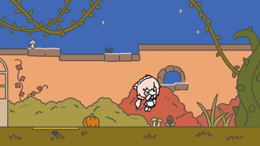

# SpookyBirthdayNight

A 2D puzzle-platformer built in Unity, featuring Halloween-themed visuals and puzzle-focused progression. Created as a personal project to practice game architecture, level design logic, and Unity workflows. All programming work was done by me; art assets were created by a collaborator, and audio uses licensed free resources.

## Play

- **Web Version (Browser):** https://redpandafudge.github.io/SpookyBirthdayNight/
- **Windows Build:** Available in the [Releases](../../releases) section.

## Screenshots

## Features

- Puzzle-driven progression  
- Simple platforming mechanics  
- Halloween-themed environment  

## Controls

- Move: A/D or ←/→  
- Jump: Space  
- Interact/Pick up: E  
- Drop: Q
- Enter/Exit room: S or ↓

_Hint: Many environmental elements respond to the **E** key—try interacting to discover puzzle clues and small details._

## Technical Details

- Unity Version: 6000.2.5f1
- Build Targets: Web + Windows
  
- Gameplay systems implemented using custom C# scripts, including puzzle interactions, state handling, and level logic  
- Player controller built with Rigidbody2D physics and custom collision checks
- Event-driven architecture and ScriptableObjects used to manage triggers, interactables, and puzzle components.
- UI created using TextMeshPro and anchored layouts, scaled dynamically via Canvas Scaler to address Web resize issues
- Web build optimized with Gzip compression and Decompression Fallback for browser compatibility  

## Building the Project

- **Open the Project:** Open in Unity 6000.2.5f1.
- **Web Build:** File → Build Profiles → Web → Build.
- **Windows Build:** File → Build Profiles → Windows → Build.

## Credits

Programming: Ella Chen  
Art Assets: Kirin  
Audio: 効果音ラボ, こんとどぅふぃ, にゃるぱかBGM工房, 魔王魂  

